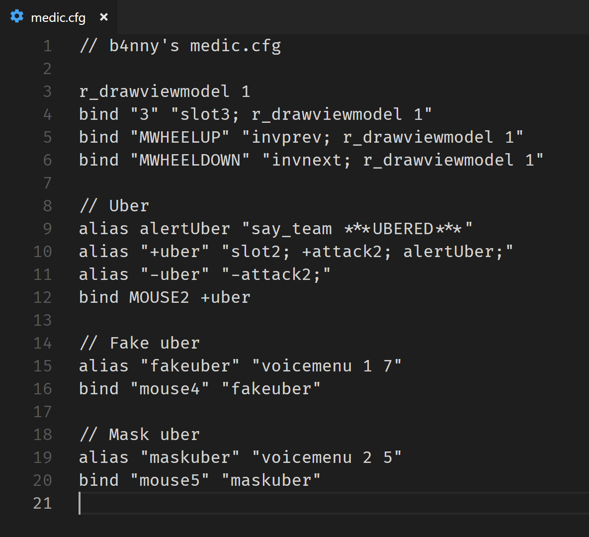
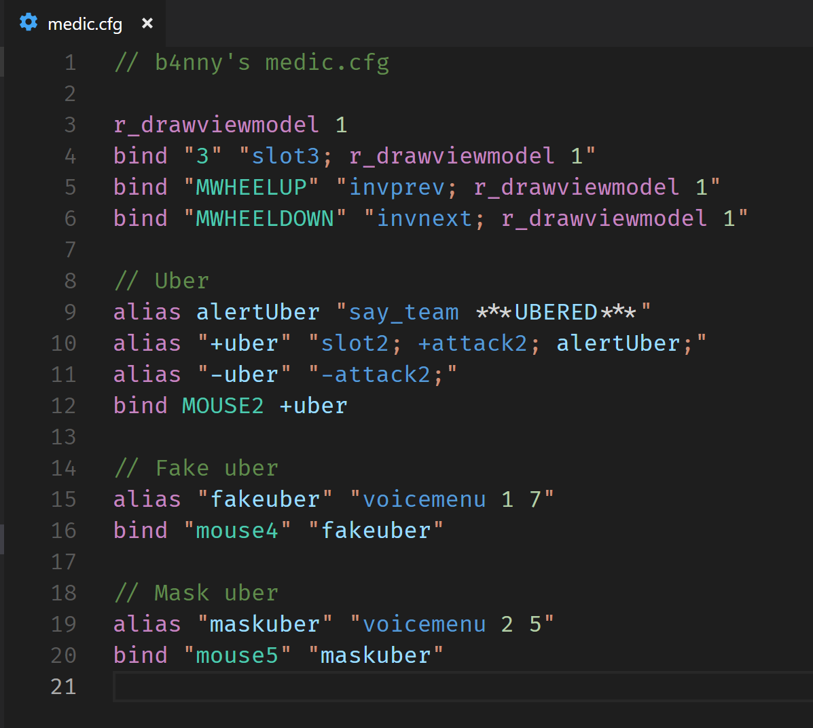
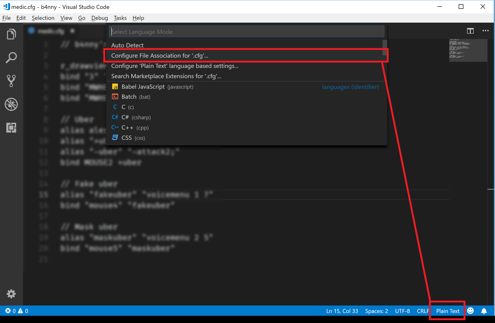
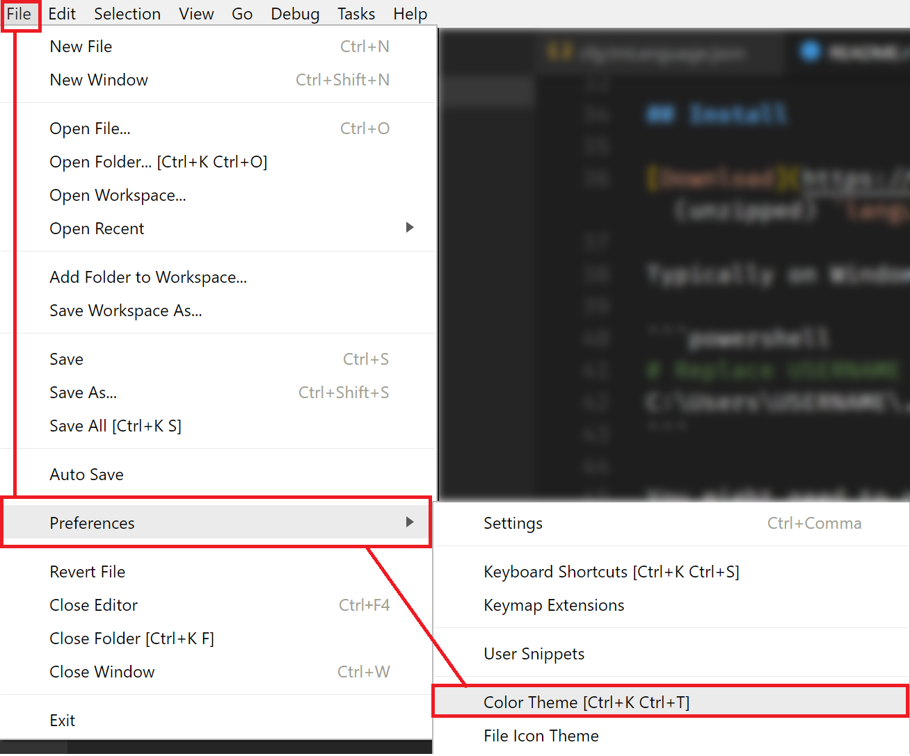

# TF2 cfg syntax highlighting

Adds syntax highlighting support for `.cfg` files

## Features

<blockquote>
  <p><code>medic.cfg</code> adapted from b4nny's <a href="https://drive.google.com/file/d/1S9bcuSHauGUSNlrOP93zm5kOlynnWG8V/view" target="_blank">config</a>
</blockquote>
<table>
  <tr>
    <td></td>
    <td></td>
  </tr>
  <tr>
    <td><i>Plain Text</i></td>
    <td><i>Using the <code><b>Dark+ (default dark)</b></code> theme</i></td>
  </tr>
</table>

This is the grammar I'm tagging:

- Comment
- Command
  - Unknown (deprecated, unused, or just unknown)
  - [Buttons](https://wiki.teamfortress.com/wiki/Scripting#List_of_key_names) (`SPACE`, `MOUSE1`)
  - Actions (`+attack`, `say_team`)
  - Settings (`alias`, `bind`, `r_drawviewmodel`)
- Numeric-Literal
- Variable (custom commands)
- Command List (`"+jump; +duck; +attack;"`)
- Punctuation-Semicolon

## Install

[Download](https://github.com/reed-tf2/language-tf2-cfg/archive/master.zip) and unzip, or `clone` this package. Move the (unzipped) `language-tf2-cfg` folder into your `~/.vscode/extensions/` folder.

Typically on Windows this is:

```powershell
# Replace USERNAME with your user name
C:\Users\USERNAME\.vscode\extensions\
```

You might need to restart VS Code.

## Setup



1.  Open a `.cfg` file
1.  Click at the bottom right to change its "File Association" (Or press `Ctrl+K, Ctrl+M`)
1.  Select, `Configure File Association for '.cfg'...`
1.  Select `TF2 cfg` from the list

### Alternatively...

You can open your user settings (`Ctrl+,`) and add

```json
"files.associations": {
  "*.cfg": "cfg"
}
```

## Theme

Note that you can change/control the [Color Theme](https://code.visualstudio.com/docs/getstarted/themes):



## Known Issues

- Not [all](https://developer.valvesoftware.com/wiki/List_of_TF2_console_commands_and_variables) commands have been included yet
- Lazy regex checking, such as `r_\\w+` to mark anything that starts with `r_`, but really should only include exact commands
- My regex has not been reviewed and there's potentially a smarter way to be doing some of the things
- Ideally there'd be a custom color theme with property scope names (currently I'm using at least one `.js` name)

## Release Notes

### 0.0.1

:construction: Still getting things into shape
